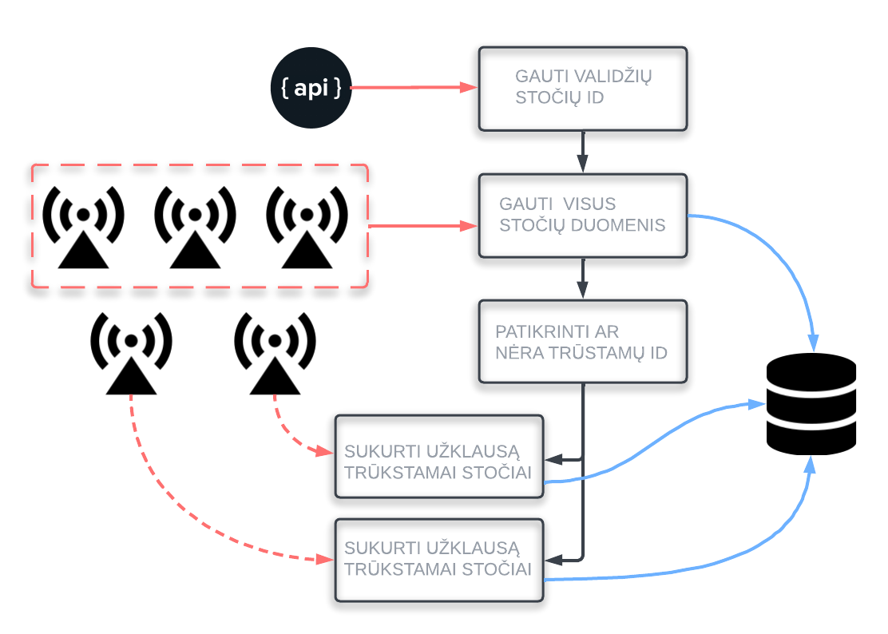

# Techninės užduoties sprendiniai

[STREAMLIT APLIKACIJA SU SQL SPRENDINIAIS
](https://vytautaspliadis-sitingi-srcstremlit-app-fr6zhh.streamlit.app/)
## 1. Neaktyvūs objektai
Visų **šiuo metu** neaktyvių objektų sąrąšas (objekto nueris, neaktyvus nuo, nekatyvus iki)

```sql
SELECT 
    o.obj_numeris AS objekto_numeris
    , b.busena_nuo AS busena_nuos
    , b.busena_iki AS busena_iki
FROM 
    busenos b
JOIN 
    objektai o ON b.obj_id = o.obj_id
WHERE 
    b.busena = 2
    AND (b.busena_iki IS NULL OR b.busena_iki >= CURRENT_DATE);
```

## 2. Objektai su naujausia būsena
Kiekvieno objekto numeris ir jo naujausios būsenos statusas (tekstas ir data)

```sql
WITH paskutinis_statusas_cte AS (
    SELECT
        obj_id
        , MAX(busena_nuo) AS max_busena_nuo
    FROM
        busenos
    GROUP BY
        obj_id
)
SELECT
    o.obj_numeris AS objekto_numeris
    , bk.busena_tekstas AS busena_tekstas
    , b.busena_nuo AS busena_nuo
FROM
    busenos b
JOIN
    objektai o ON b.obj_id = o.obj_id
JOIN
    busena_kodai bk ON b.busena = bk.busena_kodas
JOIN
    paskutinis_statusas_cte ps ON b.obj_id = ps.obj_id AND b.busena_nuo = ps.max_busena_nuo;
```

# 3. Objektai su galiojančia ir prieš tai buvusia būsena
Kiekvieno objekto šiuo metu galiojantis ir prieš tai buvęs statusas (objekto numeris, dabartinė būsena, ankstesnė būsena)
```sql
WITH buves_statuas AS (
    SELECT
        bb.obj_id
        , bk.busena_tekstas AS buves_statusas
        , bb.busena_iki AS buvusio_statuso_pabaigos_data
        , ROW_NUMBER() OVER (PARTITION BY bb.obj_id ORDER BY bb.busena_iki DESC) AS rn
    FROM
        Busenos bb
    JOIN
        Busena_kodai bk ON bb.busena = bk.busena_kodas
    WHERE
        bb.busena_iki IS NOT NULL
),
esamas_statusas AS (
    SELECT
        eb.obj_id
        , bk.busena_tekstas AS esamas_statusas
        , ROW_NUMBER() OVER (PARTITION BY eb.obj_id ORDER BY eb.busena_nuo DESC) AS rn
    FROM
        Busenos eb
    JOIN
        Busena_kodai bk ON eb.busena = bk.busena_kodas
    WHERE
        eb.busena_iki IS NULL
)
SELECT
    o.obj_numeris AS objekto_numeris
    , es.esamas_statusas AS esamas_statusas
    , bs.buves_statusas AS buves_statusas
FROM
    Objektai o
LEFT JOIN
    (SELECT * FROM buves_statuas WHERE rn = 1) bs ON o.obj_id = bs.obj_id
LEFT JOIN
    (SELECT * FROM esamas_statusas WHERE rn = 1) es ON o.obj_id = es.obj_id;
```

## 4. Objektai be galiojančio plano
```sql
SELECT 
    o.obj_numeris
FROM 
    objektai o
LEFT JOIN 
    planai p
ON 
    o.obj_id = p.obj_id 
    AND (p.pln_galioja_iki IS NULL OR p.pln_galioja_iki >= CURRENT_DATE)
WHERE 
    p.pln_id IS NULL;
```

# Sistemos dizaino pasiūlymas 
## ETL procesas naudojant Airflow

Naudojamas Airflow DAG'as, kuris periodiškai (kasdieniną) kviečia išorinį API ir įkelia gautus duomenis į duomenų bazę.
Duomenys yra renkami už vakarykštį paros periodą, nes priklausomai nuo duomenų šaltinio gali būti, kad duomenys dar nėra pilnai atnaujinti.
Galimybė „perkrauti“ tam tikrą dieną įgyvendinama perkraunant DAG'a rankiniu būdu, arba rankiniu būdu su parametrais, 
nurodant specifinį dienų ruožą (trigger_dag with parameters/config).

## Variantas 1: Duomenų įkėlimas naudojant SQL

Pagrindinėje lentelėje (target) laikomi visi istoriniai duomenys. 'Šaltinio' lentelėje (source) yra laikomi vakar dienos duomenys. 
Naudojamas MERGE INTO SQL komanda, kuri leidžia atnaujinti arba įkelti naujus duomenis į duomenų bazę.
Jei nėra vieno unikalaus rakto, galima naudoti kombinuotą unikalų raktą, kuris sudarytas iš kelių stulpelių.
```sql
MERGE INTO target_table AS target
USING source_table AS source
ON target.column1 = source.column1
   AND target.column2 = source.column2
WHEN MATCHED THEN
    UPDATE SET 
        target.column3 = source.column3,
        target.column_n = source.column_n
WHEN NOT MATCHED THEN
    INSERT (column1, column2, column3, column_n)
    VALUES (source.column1, source.column2, source.column3, source.column_n);
```
## Variantas 2: Duomenų įkėlimas naudojant ORM

Labiau 'pitokiškas' būdas - naudoti SQLModel biblioteką. Tai apima tiek Pydantic (validaciją), tiek SQLAlchemy (duomenų bazės sąveiką).
Tokiu būdu galima aprašyti duomenų bazės lenteles kaip Python klases. 
Štai pavyzdys ORM iš prieš tai buvusios užduoties, kuriame sukuriami ryšiai tarp objektų:
```python
class Objektai(SQLModel, table=True):
    obj_id: int = Field(default=None, primary_key=True)
    obj_numeris: int = Field(unique=True)
    busenos: List["Busenos"] = Relationship(back_populates="objektas")
    planai: List["Planai"] = Relationship(back_populates="objektas")

class Busenos(SQLModel, table=True):
    busena_id: int = Field(default=None, primary_key=True)
    obj_id: int = Field(foreign_key="objektai.obj_id")
    busena: int
    busena_nuo: datetime
    busena_iki: Optional[datetime] = Field(default=None, nullable=True)
    objektas: "Objektai" = Relationship(back_populates="busenos")

class Busena_kodai(SQLModel, table=True):
    busena_kodas: int = Field(default=None, primary_key=True)
    busena_tekstas: str

class Planai(SQLModel, table=True):
    pln_id: int = Field(default=None, primary_key=True)
    obj_id: int = Field(foreign_key="objektai.obj_id")
    pln_galioja_nuo: datetime
    pln_galioja_iki: Optional[datetime] = Field(default=None, nullable=True)
    objektas: "Objektai" = Relationship(back_populates="planai")
```


# Sistemos dizaino pasiūlymas meteo duomenims


## DAG Aprašymas

`dags/meteo_data_pipline.py` skirtas automatiškai gauti meteorologinių stočių duomenis. DAG'as veikia kas dieną ir atlieka šiuos veiksmus:

- Parsisiunčia visų stočių ID iš API.
- Parsisiunčia duomenis apie visas meteorologines stotis.
- Įkelia duomenis į PostgreSQL duomenų bazę.
- Nustato, kurių stotčių trūksta (remiantis ID sąrašu).
- Dinamiškai suria atkiras užduotis trūkstamoms stotims
- Paraleliškai parsisiunčia ir įkelia trūkstamų stočių duomenis į duomenų bazę.

Konstantos:
- ALL_STATIONS_IDS_ENDPOINT – API URL visų stočių ID gauti.
- ALL_STATIONS_DATA_ENDPOINT – API URL visų stočių duomenims gauti.
- SPECIFIC_STATION_DATA_ENDPOINT – API URL konkrečios stoties duomenims gauti.
